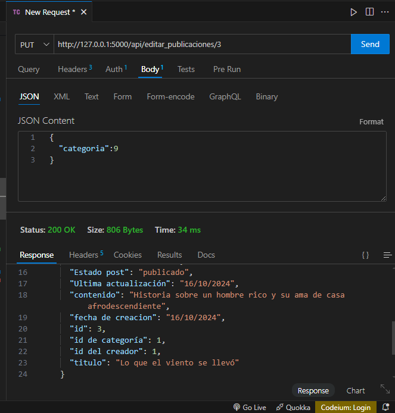

<h1 align="center">Blog</h1>

Este proyecto es una continuación de los 2 anteriores, una integración de todolist y gestion de usuarios. 

El objetivo de esta API es poder registrar usuarios, tanto administradores (con sus permisos excepcionales) como usuarios regulares, los cuales tendran restricciones en algunos sectores de la API. Se podrá crear publicaciones, comentar las mismas, crear categorías (unicamente con los admins)

## Test

> Aclaración: las pruebas serán hechas en ThunderClient, desde VSCode, también lo hice con Postman pero por comodidad continuaré con el primero y la ejecución de la API lo realizo en el CMD de Windows directamente en vez de la consola del IDE.  Las capturas de la misma serán almacenadas en el propio repositorio.
<ol>
  <li>Ejecutamos localmente el servicio.</li>
    
  <li>Primer GET para saber si conecta correctamente a la API.</li> 
  <li>Completamos los datos para el registro del usuario.</li> 
  
  <li>Luego ingresamos al endpoint de login</li> 
    

  <li>Una vez dentro, podemos ver tanto nuestros datos como la de los demás usuarios.</li> 
    

  <li>Unicamente podemos modificar nuestros datos y en caso de que seamos "admin" podemos modificar otros usuarios con el método PUT. En este caso pusimos el nombre y apellido con la primer letra en mayúsculas.</li> 
    

  <li>Luego utilizamos otro GET para ver si efectivamente se realizó la actualización.</li> 
    

  <li>Ahora intentamos, con un usuario standar, crear una categoria</li> 
    

  <li>Ahora cambiamos el rol del usuario</li> 
    

  <li>Una vez cambiado el rol, nos permite crear la categoría</li> 
    

  <li>Ya tenemos lo básico para crear nuestro primer posteo</li> 
    

  <li>Ahora vemos como figura cuando utilizamos en GET</li> 
  

  <li>Realizamos la creación de varias categorías para más ejemplos</li> 
    

  <li>Ahora podemos actualizar nuestro post con alguna otra categoría</li> 
    

    

    
</ol>

Lo que me percaté, luego de la creación de varias categorías, fue algunas faltas de ortografía, por ejemplo "Accion" en vez de "Acción". Por lo tanto, pensé que es normal y una manera de revertir es darle a los admins la posibilidad de corregirlo.

<ol>
    <li>Aquí el ejemplo</li> 
      
    <li>Hacemos el cambio</li> 
      
    <li>Revisamos la lista y observamos si salió bien</li> 
     
</ol>

## Glosario

<table>
  <thead>
    <th>Endpoint</th>
    <th>¿Qué hace?</th>
  </thead>
  <tbody>
    <tr>
      <td>127.0.0.1:5000/</td>
      <td>Muetra un texto simple para saber que se conecta correctamente con un GET.
      </td>
    </tr>
    <tr>
      <td>/api/register</td>
      <td>Permite registrar a un usuario nuevo a través del método POST.</td>
    </tr>
    <tr>
      <td>/api/login</td>
      <td>Poder hacer login con el método POST</td>
    </tr>
    <tr>
      <td>
        /api/fetch/&lt;int:id_user&gt;
      </td>
      <td>Una vez logeado permite ver a cualquier usuario indicando el número de ID</td>
    </tr>
        </tr>
        <tr>
      <td>/api/fetch/edit/&lt;int:id_user&gt;</td>
      <td>Permite editar al usuarios, siempre y cuando quien edite sea el propio usuario o tenga el rol de "admin", a traves del método 'PUT'</td>
    </tr>
        </tr>
    <tr>
      <td>/api/fetch/edit_status/&lt;int:id_user&gt;</td>
      <td>Permite cambiar el status al usuario seleccionado, hay 3 opciones, "activo", "inactivo" y "bloqueado".</td>
    </tr>
    <tr>
        <td>/api/publicaciones</td>
        <td>Vemos todas las publicaciones con sus datos correspondientes</td>
    </tr>
    <tr>
        <td>/api/publicacion/&lt;int:post_id&gt;</td>
        <td>Buscamos un post determinado por su ID</td>
    </tr>
    <tr>
        <td>/api/crear_publicacion</td>
        <td>A traves del método POST podemos crear un post nuevo</td>
    </tr>
  </tbody>
</table>